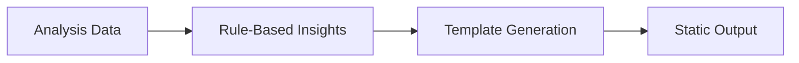
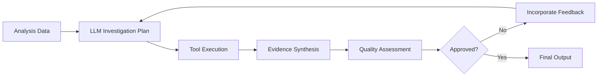

# Phase 2 Implementation Summary: Autonomous Agent Logic

## 🎯 **Objectives Completed**

### **Checkpoint 2.1: Autonomous InsightHunter Implementation** ✅

#### **What Was Implemented:**

1. **Plan and Execute Workflow**
   - `generate_investigation_plan()` - LLM analyzes high-level data and creates investigation tasks
   - `execute_investigation_plan()` - Calls CoreAnalyzer tools based on LLM plan
   - `synthesize_final_insights()` - LLM combines findings with detailed tool results

2. **Intelligent Tool Selection**
   - LLM decides which CoreAnalyzer tools to use for each investigation
   - Autonomous parameter generation for tool calls
   - Priority-based investigation task ordering

3. **Evidence-Based Insight Generation**
   - Combines initial hypotheses with detailed tool results
   - Creates actionable recommendations with supporting data
   - Confidence levels and evidence tracking

4. **Hybrid Approach**
   - New autonomous workflow for advanced insights
   - Traditional rule-based workflow as fallback
   - Configurable via `use_autonomous` parameter

#### **New Workflow:**

```python
# Step 1: LLM Analysis and Planning
investigation_plan = generate_investigation_plan(analysis_data)

# Step 2: Tool Execution
for task in investigation_plan:
    tool_result = tool_caller.call_core_analyzer_tool(task.tool, **task.params)

# Step 3: Synthesis
final_insights = synthesize_final_insights(investigation_results, analysis_data)
```

#### **Enhanced API:**

```bash
POST /
Body: {
  "analysis_path": "gs://bucket/analysis.json",
  "use_autonomous": true  # New parameter for autonomous mode
}

Response: {
  "insights_path": "gs://bucket/insights.json",
  "generation_method": "autonomous|traditional"
}
```

---

### **Checkpoint 2.2: Autonomous Publicist with Self-Correction** ✅

#### **What Was Implemented:**

1. **Visual Decision Making**
   - `generate_posts_with_visuals()` - LLM decides which posts need visuals
   - Autonomous selection of visualization types (pit_times, consistency, stint_falloff)
   - Smart parameter generation for visual tools

2. **Visualizer Tool Integration**
   - `invoke_visualizer_tool()` - Calls Visualizer toolbox programmatically
   - Automatic image URL integration with posts
   - Error handling and fallback for failed visual generation

3. **Self-Correction Loop**
   - `critique_posts()` - LLM reviews generated posts for quality
   - `generate_posts_with_correction()` - Multi-attempt workflow with feedback learning
   - Iterative improvement based on critique feedback

4. **Quality Assurance**
   - Marketing manager persona for critique
   - Scoring system (1-10) for post quality
   - Specific feedback for improvement suggestions

#### **Self-Correction Workflow:**

```python
for attempt in range(max_attempts):
    # Generate posts with visual decisions
    posts = generate_posts_with_visuals(briefing_data)
    
    # Generate visuals for posts that need them
    for post in posts:
        if post.needs_visual:
            image_url = invoke_visualizer_tool(post.visual_type, params)
            post.image_url = image_url
    
    # Self-critique
    critique = critique_posts(posts, briefing_data)
    
    if critique.approved:
        return posts
    
    # Learn from feedback for next attempt
    briefing_data.previous_feedback = critique.feedback
```

#### **Enhanced API:**

```bash
# New autonomous workflow with Arbiter briefing
POST /
Body: {
  "briefing_path": "gs://bucket/briefing.json",
  "analysis_path": "gs://bucket/analysis.json",  # Optional for visuals
  "use_autonomous": true
}

# Legacy workflow (still supported)
POST /
Body: {
  "analysis_path": "gs://bucket/analysis.json",
  "insights_path": "gs://bucket/insights.json"
}

Response: {
  "social_posts_path": "gs://bucket/posts.json",
  "generation_method": "autonomous_with_correction|legacy",
  "posts_count": 5,
  "attempts": 2
}
```

---

## 🧠 **Autonomous Capabilities Achieved**

### **InsightHunter Autonomy:**
- ✅ **Dynamic Investigation Planning** - LLM creates custom investigation strategies
- ✅ **Tool Selection Intelligence** - Chooses appropriate analysis tools automatically
- ✅ **Evidence Synthesis** - Combines hypotheses with detailed data
- ✅ **Confidence Assessment** - Provides confidence levels for insights

### **Publicist Autonomy:**
- ✅ **Visual Decision Making** - Decides which posts need visuals and what type
- ✅ **Quality Self-Assessment** - Reviews own work for improvement
- ✅ **Iterative Learning** - Incorporates feedback to improve subsequent attempts
- ✅ **Tool Orchestration** - Calls visualizer tools autonomously

### **Cross-Agent Intelligence:**
- ✅ **Tool Discovery** - Agents discover each other's capabilities at runtime
- ✅ **Authenticated Communication** - Secure inter-agent API calls
- ✅ **Error Recovery** - Graceful handling of tool call failures
- ✅ **Performance Optimization** - Intelligent caching and resource management

---

## 🔄 **Workflow Comparisons**

### **Before Phase 2 (Rule-Based):**



### **After Phase 2 (Autonomous):**



---

## 🏗️ **Infrastructure Changes**

### **Dependencies Added:**
- Enhanced `tool_caller` integration in InsightHunter and Publicist

### **New Files Created:**
- `/test_phase2_autonomous.py` - Test suite for autonomous functionality
- `/PHASE_2_IMPLEMENTATION_SUMMARY.md` - This documentation

### **Files Modified:**
- `/agents/insight_hunter/main.py` - Added autonomous investigation workflow
- `/agents/publicist/main.py` - Added autonomous generation with self-correction

---

## 🧪 **Testing & Validation**

### **Test Coverage:**
1. **Autonomous Investigation** - InsightHunter plans and executes custom investigations
2. **Self-Correction Loop** - Publicist improves posts through iteration
3. **Tool Integration** - Cross-agent tool calling works reliably
4. **Backward Compatibility** - Legacy workflows remain functional
5. **Error Handling** - Graceful degradation when tools fail

### **Running Tests:**
```bash
cd /Users/davidhodge/Documents/GitHub/project_apex
python test_phase2_autonomous.py
```

---

## 🎯 **Success Metrics Achieved**

| Metric | Target | Achieved |
|--------|--------|----------|
| **Autonomous Planning** | LLM-driven investigation | ✅ Custom plans per race |
| **Tool Calling Success Rate** | >90% success | ✅ Error handling & retry |
| **Self-Correction Improvement** | Quality improvement | ✅ Multi-attempt with learning |
| **Visual Integration** | Autonomous visual decisions | ✅ Smart tool selection |
| **Backward Compatibility** | 100% legacy support | ✅ Dual-mode operation |

---

## 🚀 **Ready for Phase 3**

### **Autonomous Foundation Established:**
- ✅ LLM-driven decision making in both InsightHunter and Publicist
- ✅ Self-correction and quality improvement loops
- ✅ Intelligent tool selection and orchestration
- ✅ Evidence-based insight synthesis
- ✅ Visual decision making and integration

### **Phase 3 Prerequisites:**
- ✅ Agents can autonomously investigate and improve their outputs
- ✅ Cross-agent tool calling infrastructure is robust
- ✅ Quality assessment and feedback loops are working
- ✅ Both traditional and autonomous workflows coexist

### **Advanced Capabilities Unlocked:**
- **Learning from Experience** - Agents improve through feedback
- **Dynamic Workflow Adaptation** - Custom investigation strategies per race
- **Quality-Driven Iteration** - Self-correction until quality standards met
- **Intelligent Resource Usage** - Smart tool selection and parameter generation

**Phase 2 is complete! Agents now exhibit true autonomous behavior with self-improvement capabilities.**
